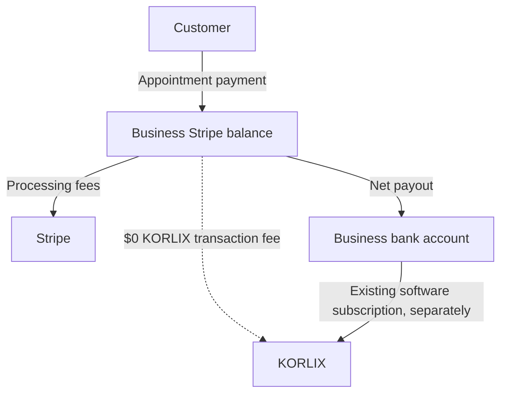

# KORLIX merchant payments — subscription-only Connect plan

Current checkpoint: the single hosted USD 1.00 sandbox sequence has passed. The [2026-10-06 production readiness review](STRIPE_PRODUCTION_READINESS_20261006.md) records the remaining merchant-readiness, live-configuration and onboarding gaps. Older acceptance statements below are historical; production checkout remains paused.

Decision recorded 2026-10-05: businesses use KORLIX to collect payments from their own customers. The existing KORLIX subscription is the platform's monetization; KORLIX adds no transaction fee. Businesses still pay their own Stripe processing fees. Begin with 2MEETU appointments, then extend the connection to Funnel checkout and Bookkeeping invoices in later work.

## Account configuration

Use Accounts v2 (`/v2/core/accounts`) for new business accounts, with `dashboard: "full"`, `defaults.responsibilities.fees_collector: "stripe"` and `defaults.responsibilities.losses_collector: "stripe"`. Direct-charge businesses need `configuration.merchant` and requested `card_payments` capability; payout capability is requested automatically. Do not use a legacy account `type` for new account creation.

The current patch checks already connected accounts through v2. It does not create accounts. Stripe documents that v1-created accounts can take time to become available through v2. For the explicit `v1_account_instead_of_v2_account` or `account_not_yet_compatible_with_v2` HTTP 400 errors, OAuth callback and owner confirmation may verify identity through `/v1/accounts/{id}` instead. This identity-only path still requires the exact authorized account ID, full Dashboard access, account-paid Stripe fees, and Stripe-managed losses/requirements. It always records payment readiness as false, regardless of legacy payment flags. Checkout never uses this compatibility path and still requires fresh v2 capability verification.

## Charge pattern

Use direct charges on each connected business's Stripe account. The business sells the appointment and receives its proceeds, while KORLIX supplies the software. Existing Checkout Session requests use the server-selected `Stripe-Account` header, with no destination transfer or KORLIX application fee.

## Business onboarding

For new businesses, recommend embedded onboarding: KORLIX creates an owner-bound v2 merchant account, then Stripe collects the required identity and business information within its component. This keeps the user in KORLIX while Stripe handles verification forms and updated requirements. Enable payment acceptance only after independent capability verification, and continue checking before new checkouts.

The existing-account route remains OAuth with `read_write` scope because creating payments and refunds requires write access. The existing one-use state, browser binding, encrypted account grant, and explicit owner confirmation are preserved. No customer pastes a secret API key into KORLIX.

**Implementation boundary:** existing-account authorization is already present; v2 account creation, embedded onboarding, and a shared connection across other KORLIX tools remain planned work.

## Dashboard access

Businesses use their full Stripe Dashboard directly at [dashboard.stripe.com](https://dashboard.stripe.com). This fits independent businesses that manage their own processing, payment methods, disputes and bank details; KORLIX does not generate Express login links for them.

## Embedded components

For the future merchant settings screen, use `account_onboarding`, `notification_banner`, `account_management`, `payments` and `payouts`. The notification banner must show new requirements so businesses can keep their accounts enabled. Payments components can show direct charges owned by the connected account; confirm each enabled feature against [Stripe's supported components](https://docs.stripe.com/connect/supported-embedded-components) before implementation. None of these components is added in this backend patch.

## Webhook integration

Use signed webhooks with independent Stripe reads for reliable payment confirmation. The implemented scheduling handlers cover Checkout completion/expiration, asynchronous payment success/failure, and charge refunds; see the [scheduling operations guide](korlix-scheduling.md). Real signed payment-completion replay and refund delivery have passed isolated acceptance below. Original signed expiry-event delivery to the deployed destination has also passed; deployed paid-booking confirmation and the actual customer return flow remain open.

## Readiness gating

Each new Checkout creation or retry must retrieve the expected account and confirm the sandbox/live mode, full dashboard, Stripe fee/loss responsibilities, and both capabilities:

- `configuration.merchant.capabilities.card_payments.status === "active"`
- `configuration.merchant.capabilities.stripe_balance.payouts.status === "active"`

The backend also requires complete provider settings and `KORLIX_SCHEDULING_STRIPE_ENABLED=true`. An absent, misspelled or false switch keeps new paid bookings and checkout off. The switch is excluded from the credential fingerprint so pausing does not invalidate saved grants. The database's existing `charges_enabled` column is only a projection of the v2 result.

## Fees and funds flow

KORLIX's transaction fee is **$0**. The internal recommendation value is `applicationFeeIncludes: "platform_fee_only"`: the platform does not add an estimate of Stripe fees or retain payment margin. `application_fee_amount` is an optional additional amount paid to a platform; for this model it is omitted, as are transfer routing fields. This is a design label, not a Checkout API parameter. Do not enable a Platform Pricing Tool rule that adds a platform fee, and verify the actual sandbox charge has no application fee before launch.

The connected business pays Stripe directly under Stripe-owned processing pricing. Its net proceeds are the customer payment less applicable Stripe fees and any adjustments. Rates vary by location and payment method; use [Stripe pricing](https://stripe.com/pricing) rather than hardcoded estimates.



## SaaS monetization

Keep the existing KORLIX subscription and entitlement policy. Do not create another subscription when a business connects Stripe. If billing connected accounts themselves is migrated to Accounts v2 later, use `customer_account` on the supported SetupIntent/subscription flows and map the existing subscription deliberately; do not create a duplicate v1 Customer solely for Connect. Current KORLIX web subscription checkout and Directory checkout remain paused independently.

## Negative balance liability

Recommend and verify `losses_collector: "stripe"` for these direct-charge business accounts. This assigns connected-account negative balance responsibility to Stripe under the selected Connect configuration; it does not eliminate the business's refund, dispute or repayment obligations under its Stripe agreement or guarantee that KORLIX has no contractual obligations.

## Risk management

Businesses use Stripe's risk tooling for their direct payments. KORLIX still enforces account ownership, payment limits, immutable checkout payloads, idempotency, signed callbacks and independent payment verification. A completed redirect never confirms a booking. Payments settling after the appointment hold expires may need a full refund; validate delayed payment methods in the sandbox before enabling them for live appointment sales.

## Implementation and rollout

1. **Prepared and locally tested:** explicit off-by-default payment switch; v2 merchant readiness; direct Checkout with dynamic eligible payment methods and no application fee; preserved payment confirmation and refund handling during a pause; public health status with no secrets.
2. **Stripe sandbox Connect verified:** although `EnableConnect` previously timed out twice, the user's Dashboard and a subsequent `GetAccounts` read confirm Connect is available in `Korlix INC sandbox`. Two test connected accounts already exist. One has full Stripe Dashboard access, account-paid processing fees and Stripe loss responsibility in the v1 controller projection; its v2 capability read and use by the KORLIX app remain unverified. The Dashboard's existing $200 test activity is not evidence that the new 2MEETU integration has passed acceptance.
3. **Isolated acceptance environment prepared and used:** the separate **KORLIX 2MEETU Testing** sandbox, browser-authorized CLI session, signing secret and private local PGlite ledger isolate payment tests from production. Preserve the local encryption key and ledger for recovery. No API key or OAuth token is copied from production or extracted from the CLI session. Production checkout configuration is unchanged.
4. **Provider acceptance partially verified:** actual v2 readiness, USD 1.00 direct Checkout, independent paid-payment reconciliation, zero application fee, full owner-requested refund while paused, signed payment-completion replay/duplicate handling, and real signed refund-event delivery passed. Original signed expiry-event delivery to the deployed webhook also passed. Deployed paid-booking confirmation, the actual customer return flow, declines and delayed success/failure remain unverified. The evidence and its limits are recorded below.
5. **Build new-business onboarding:** add v2 account creation and the selected embedded components with owner-bound sessions and current requirements handling. Validate separately from existing-account OAuth.
6. **Live launch only after explicit go-live authorization and readiness:** review platform activation, permitted businesses/countries, business verification, tax handling, signed webhook delivery and operational refund support. Keep KORLIX web sales, Directory sales and 2MEETU payment switches false until their applicable launch gates are cleared.
7. **Later scope:** Funnel purchases and Bookkeeping invoice payments reuse the merchant connection after their own checkout, bookkeeping and refund workflows are built and tested. They are not implemented by this patch.

Pausing prevents new paid bookings and opening checkout through KORLIX. It does not revoke an already issued Stripe Checkout URL; use Stripe-side expiration if outstanding unpaid sessions must also be stopped. Payment confirmations and refunds intentionally remain available when credentials are configured.

## Why this fits KORLIX

- Independent businesses collect their own customer payments and retain full Stripe account access.
- Subscription revenue pays for KORLIX software; there is no additional platform transaction fee.
- 2MEETU already has a direct-charge, idempotent payment ledger that can be activated after provider testing.
- The framework can be deployed without enabling sales or changing existing subscription entitlements.

## Verification evidence

Focused local command:

```sh
node --test backend/test/scheduling.test.mjs backend/test/scheduling_connected.test.mjs backend/test/scheduling_voice.test.mjs backend/test/scheduling_stripe_provider.test.mjs
```

Initial result on 2026-10-05: **53 passed, 0 failed**. Provider responses in these tests are fixtures. Coverage includes full booking lifecycle and ownership checks, invalid account/mode/responsibilities, unavailable payment/payout capabilities, rejected fee/transfer injection, explicit activation, free bookings during pause, signed confirmation during pause, and completed queued refunds during pause. Those fixture tests made no Stripe transactions. Subsequent regression and actual sandbox evidence are recorded in the checkpoints below.

### Configuration checkpoint — 2026-10-05 UTC

The user supplied public sandbox OAuth client ID `ca_VNdRanZuoOmsl6nhhnunPkqTdRYu9hVo`. It is staged as `KORLIX_SCHEDULING_STRIPE_CLIENT_ID` on the disabled scheduling integration. Render deployment `dep-db1f8rs9v7es73f9nl3g` of application commit `70e23e2a158ff2383ff69b5abe9e146928747eae` is live. The scheduling, web subscription and Directory enable flags are all explicitly `false`.

The user saved the dedicated scheduling sandbox API key directly in Render; no secret API keys were requested through chat or copied from other production settings. A sandbox connected-account webhook was created as `we_1UN0aSLx6hd5l5Vo1WXs2c04`, targeting `https://chee-chai-chee-backend.onrender.com/api/scheduling/payments/webhook`. A follow-up Stripe read confirms it is enabled, `livemode=false`, and belongs to the same public OAuth application ID. It subscribes to `checkout.session.completed`, `checkout.session.expired`, `checkout.session.async_payment_succeeded`, `checkout.session.async_payment_failed`, and `charge.refunded`. Its API version is unset, so it inherits the account default; outbound application API calls remain pinned to `2026-09-30.endive`. The returned signing secret was transferred directly into `KORLIX_SCHEDULING_STRIPE_WEBHOOK_SECRET` without displaying it. The historical disabled Directory test endpoint was left untouched.

Render deployment `dep-db1fn56gekts73dk6q00` of commit `35550916783dcf049d7bdf48f7da3c479f914cc6` completed at 2026-10-05 01:21:54 UTC. Startup and public health now report the scheduling provider configured, `checkoutEnabled=false`, `livePayments=false`, and zero platform fee. All three checkout flags were explicitly preserved as `false`. These checks establish that configuration is loaded, not that the API key is valid or that Stripe has delivered a signed event successfully.

This is configuration staging in the previously unconfigured, dedicated scheduling integration on the existing backend. It is not an isolated acceptance environment and does not authorize production test bookings. Existing web subscription and Directory credentials were not changed. An isolated acceptance environment remains required for actual end-to-end test bookings.

The user's 2026-10-05 01:26 UTC screenshot verifies that OAuth is enabled in the sandbox and `https://chee-chai-chee-backend.onrender.com/api/scheduling/connect/stripe/callback` is saved as the default redirect. The user then initiated authorization from 2MEETU and chose Stripe's blank test account. Stripe created `acct_1UN0lvLxhlZExezM`; a Stripe read shows a full-dashboard account with Stripe fee/loss responsibility and payment/payout capabilities not yet enabled. The callback returned HTTP 503 at 01:32:57 UTC with a generic provider error, so the KORLIX connection did not complete.

Diagnostic support now logs only the Stripe operation phase, HTTP status, validated error code and request ID. It excludes raw URLs, credentials, authorization codes, provider messages and customer data. An optional `KORLIX_SCHEDULING_STRIPE_PROBE_ACCOUNT` performs one read-only account verification on startup, only when scheduling checkout is paused, settings are configured and the key has a test prefix. It does not persist a connection or create a payment. Stripe documents that newly created v1 accounts can take up to ten minutes to become available to v2 reads; the actual failure still needs to be identified, and authorization codes must never be replayed.

### OAuth compatibility correction

Diagnostic deployment `dep-db1fvtfavr4c73bnv1t0` (`55238686a4adb0ec39ed029849949b2540c83957`) reproduced HTTP 400 `v1_account_instead_of_v2_account` at 01:40:33 UTC, using the saved scheduling credentials and the exact account created in the failed OAuth attempt. This confirms the account lookup incompatibility. The correction allows verified OAuth account identity and explicit owner confirmation to complete while v2 eligibility is pending. It does not grant payment readiness using legacy `charges_enabled` or `payouts_enabled` values, and it does not fall back for authentication, authorization, missing-account or platform-access errors. Account mode continues to be verified against the OAuth token exchange and configured key context.

The initial failed authorization code must not be replayed; a fresh connection from 2MEETU was required after deployment. Diagnostics regression passed 55 tests. The compatibility changes passed the 58-test focused suite; after adding the full OAuth regression, all 37 affected provider/connected-flow tests passed. Coverage includes rejected account/responsibility mismatches, no payment creation without v2 readiness, and a full fixture OAuth callback plus owner confirmation.

Correction commit `d682b32acde91522b570ac8c6ba9a24ccb8074aa` deployed as `dep-db1g31hsrm7s73bh6eqg`. At 01:47:13 UTC the read-only startup probe successfully verified the exact sandbox account with the saved scheduling key: `source=v1_identity_only`, `cardPayments=pending_v2_verification`, `payouts=pending_v2_verification`. This verifies key authentication and the corrected identity lookup against Stripe; it does not confirm a completed user OAuth flow or enable payment processing. All three public checkout status checks remain false.

### User-confirmed sandbox connection

The user initiated a fresh authorization flow. Their 2026-10-04 9:51 PM America/New_York screenshot shows the backend's **Account verified** callback page. Their 9:53 PM screenshot shows **Korlix INC sandbox**, **connected · enabled**, **TEST MODE — no real payments**, and **Stripe onboarding incomplete** in 2MEETU Connections. This verifies that the actual user OAuth callback and explicit owner-confirmation flow completed. The connection's enabled flag is separate from checkout activation; payment readiness remains false and live sales remain disabled. No sandbox payment, signed Stripe event delivery, or refund has been verified by this milestone.

### Isolated acceptance preparation

The manual [local acceptance harness](STRIPE_SANDBOX_LOCAL_ACCEPTANCE.md) now exercises the real scheduling routes against a private PGlite ledger. Its two offline tests pass, covering platform and webhook isolation, v2 readiness rejection, paused checkout, signed fixture confirmation, duplicate events, full refund while paused, and restart recovery. These are fixture results, not actual Stripe payment or delivery evidence. Production code and checkout switches were not changed for this preparation.

The harness explicitly rejects the sandbox already attached to the running backend and any enabled persisted webhook endpoint. No actual payment or refund was attempted during preparation. Stripe CLI browser authorization is distinct from an SDK API key; a CLI transport must retain explicit sandbox identity, mode, and request-scope checks.

### Separate sandbox created in the user's browser

The user's October 4, 2026 10:21 PM America/New_York screenshot confirms **KORLIX 2MEETU Testing** is open under the Sandbox banner. They selected **Your merchants collect payments directly** and opened Stripe's automatically generated test connected account. The 10:28 PM screenshot shows that merchant enabled, with card payments and payouts active in the Dashboard. Stripe's walkthrough explicitly describes its USD 100 sample payment and automatically collected platform fee. That sample is not an application acceptance result or proof of the intended zero-platform-fee configuration. Exact API account identity, v2 eligibility, fee/loss responsibility, isolated webhook routing, and KORLIX-created checkout/refund results still require verification. The existing connector currently lists only the original Korlix INC live account and original sandbox, so the new sandbox needs separate authorization before the runner can access it.

The manual runner now supports explicit `cli_session` authorization without extracting or accepting an API key. It verifies the authorized test context before calls and pins the actual request to that sandbox and merchant, while preserving the original payment readiness checks. All six local harness/transport tests pass using fixtures. This does not validate the production API key's permissions or establish actual Stripe payment acceptance. The user's browser approval is the next prerequisite. No production runtime, deployment, or live checkout setting changed for this work.

### CLI authorization and independent sandbox verification

The user completed Stripe CLI browser authorization on 2026-10-05 at 02:56:45 UTC. CLI OAuth identity is `acct_1UN1QuLwavBaepoe`, **KORLIX 2MEETU Testing sandbox**, in test mode, with only that sandbox listed in the authorized contexts. An independent `/v1/account` request returned the same platform ID (`req_YlnAFnap0z6TRt`). No API key or OAuth token was extracted from the CLI session.

The intended full-dashboard test merchant is `acct_1UN1WiLwavcz7g46`. Its actual Accounts v2 response (`req_v2gYNVmFfIoQWZQXW`) reports `livemode=false`, full Dashboard access, Stripe fee/loss/requirements collection, active card payments and active payouts. The separate Express sample merchant was not selected. The new sandbox's persisted webhook list is empty and unpaginated (`req_wyAqKTnF9rJR8L`), so its local acceptance events cannot be delivered to the existing production webhook through a copied endpoint.

Runtime testing exposed two manual-runner issues: its child environment omitted managed proxy/CA settings, and CLI authorization plus API subprocess overhead exceeded the ordinary 15-second provider deadline. The transport now retains trusted runtime networking settings while excluding credential, socket and API endpoint overrides. It explicitly disables CLI auto-update and telemetry. A bounded code dependency allows only the manual CLI harness to use a 45-second overall request budget; each CLI subprocess uses a 30-second limit within that overall budget and retains cancellation. Production defaults and all checkout switches remain unchanged. The focused suite passed 66 tests, including actual abort behavior; the final manual-only follow-up passed six tests after removing redundant readiness reads. Listener, harness and local client must run in one persistent network namespace.

These reads established readiness for the isolated merchant before the Checkout acceptance sequence below. No production deployment was made for these manual-runner changes.

### KORLIX-created sandbox Checkout issued and paused

The real scheduling route rejected checkout while paused with HTTP 503, `New booking payments are temporarily paused`, and created no Stripe Checkout. After enabling only the isolated local harness, it created a USD 1.00 direct Checkout for merchant `acct_1UN1WiLwavcz7g46`: session `cs_test_a17crwkOCHuTaYwy1zXsPfeYgLvUrEnUHPfROs1x1UjocHUu4s6BkZb2jK`, request `req_QXBb5XnH0X2OW9`, local booking `34359df5-2c9e-4d00-8336-2e5a6c5b9f9d`. The actual outbound headers pin the sandbox/merchant context, `Stripe-Livemode: false`, and API version `2026-09-30.endive`. The returned hosted URL was retained privately for the user. Local checkout was paused again after issuance. An already issued URL remains usable during the pause.

The earlier booking `9110b9fb-c923-470e-8e6e-1d285ff5d79e` has no Checkout, PaymentIntent or payment; its first checkout attempt stopped at an account read before any Stripe POST. Its ledger was preserved when the runner restarted with the longer CLI child limit. Both bookings are in the same private ledger at `/tmp/korlix-stripe-acceptance-tDp8pD`. The CLI listener, server and control client were started in one execution session. At this checkpoint, the issued Checkout awaited user payment. The reserved `korlix-acceptance.invalid` return page intentionally does not load on the user's iPad. No production deployment or checkout activation occurred.

### Actual sandbox payment, zero fee and refund verified — 2026-10-05 UTC

The user completed the hosted USD 1.00 sandbox Checkout and showed its expected `.invalid` return-page failure around 04:02 UTC. That screenshot was not treated as payment proof. The earlier execution session was unavailable when the user returned, and the recovered ledger contained no receipt for the original `checkout.session.completed` event; its delivery was **not verified**. The precise reason for the missing delivery was not established. The existing private ledger was recovered with checkout still paused, and an independent Stripe Checkout read (`req_PPeUWV2pPCm2q0`) verified payment and moved local booking `34359df5-2c9e-4d00-8336-2e5a6c5b9f9d` to `confirmed` / `paid`. The payment reference is `pi_3UN36OLwavcz7g461LLVxlw3`. This establishes manual reconciliation, not payment-webhook acceptance.

An independent connected-account PaymentIntent/charge read (`req_50jyLT1zhpKRqN`) verified charge `ch_3UN36OLwavcz7g461BVXJKAo`: amount **100 cents**, `livemode=false`, `application_fee=null`, and `application_fee_amount=null`. The actual KORLIX-created charge therefore has no KORLIX application fee; the earlier Stripe walkthrough sample is unrelated.

The authenticated owner refund route and normal refund worker then completed a full USD 1.00 refund while local checkout remained paused. Stripe request `req_beZcGscEl7FhS5` returned refund `re_3UN36OLwavcz7g461OENXCZe` with `succeeded` status. The ledger ended with booking `canceled`, payment `refunded`, and refund `succeeded`. Recovery reused the original payment and created only this one full refund.

After restarting the listener and harness in the same persistent runtime, Stripe CLI delivered the actual signed `charge.refunded` event `evt_3UN36OLwavcz7g461TaeAgiL`. The handler validated its signature and independently read the charge (`req_KIQO5z5EzNCQub`) before recording one event receipt. Replaying the exact event bytes and original signature within five minutes performed another independent charge read (`req_thOWn46Mnpm9wl`) and left the booking, refund state and receipt count unchanged. This verifies real signed **refund-event** delivery and idempotent duplicate handling in the local harness.

The resumed listener and harness were stopped after the successful refund and duplicate-event check. This test leaves no pending Stripe payment or refund; its private ledger is retained for evidence and recovery. These results use test funds and the isolated merchant `acct_1UN1WiLwavcz7g46`. They do not prove payment-completion webhook delivery, the deployed Render webhook destination, live payouts, or the customer's browser return flow. Production web subscription, Directory and scheduling checkout switches remained off; this acceptance work did not deploy production code or write synthetic bookings to the production database.

A follow-up public health read during the 04:00 UTC hour independently confirmed `checkoutEnabled=false` for all three deployed integrations. Scheduling reports `livePayments=false`; web subscriptions and Directory report `livePayments=true` because their existing credentials are live, while their checkout switches remain false. Credential mode does not mean sales are enabled. No operational configuration or production deployment changed during this acceptance sequence.

### Return-page behavior checked offline — 2026-10-05 UTC

The six focused tests in `backend/test/scheduling_return_page.test.mjs` passed against the actual shipped `booking.js` and Express return-page route. The page waits for its private manage response, does not trust payment-success query parameters, renders confirmed payment and full-refund cancellation correctly, rejects malformed private links, and polls pending payments only while visible and unsettled. The static route and assets retain their private-page security headers. Browser DOM and payment responses in these tests are fixtures; this is not evidence of an actual iPad redirect, visual rendering, deployed webhook delivery, or a real payment-completion event. No production code or deployment changed for these tests.

### Original payment event replay confirmed the second booking — 2026-10-05 UTC

The second USD 1.00 sandbox Checkout was `cs_test_a1RfeqvWdIxaqERhqLLaiT2Jfa7E7U1GYLoIm4x1UZeN0ErcZIqd5Qr12w`, created by the real scheduling route (`req_X6TLCQfUspAq34`) for local booking `e218569c-0fb2-4f9f-ae96-8fb017266b98`. Local checkout was paused immediately after issuance. The user completed it around 04:34 UTC. The work execution session was again unavailable on return; its checkpoint still said it was waiting, and no payment event receipt had been persisted. Neither the saved readiness marker nor the user's `.invalid` return-page screenshot was treated as successful delivery evidence.

The same private ledger was resumed paused. Before replay it still showed `awaiting_payment` / `unpaid`, no PaymentIntent, and zero outbound harness requests. A read-only Stripe event lookup (`req_cNclHr94DdLAyH`) found the actual `checkout.session.completed` event `evt_1UN3c0Lwavcz7g46sC9cE90f`, matched to that exact Checkout, booking metadata/reference, expected merchant, sandbox mode, paid status, USD currency and 100-cent amount. Stripe CLI's documented `events resend` command then queued that original event to its local listener (`req_MXTbm0p3ZYa0Nm`) using the pinned isolated platform context and Connect `--account` parameter. No new payment or persisted/public webhook endpoint was created for recovery.

The normal webhook handler accepted the freshly signed original event, independently retrieved its Checkout (`req_dIuACOw8XlA2G5`), recorded one matching receipt, and changed the existing booking to `confirmed` / `paid`, with PaymentIntent `pi_3UN3bxLwavcz7g460kqXvlqp`. No manual `reconcile`, worker `tick`, or public manage-page reconciliation ran before this transition. Replaying the exact signed delivery within its signature window returned `duplicateDeliveryIdempotent: true` for that same completion-event ID without changing booking state or receipt count. This verifies payment-completion handling through **a signed replay after listener recovery**; it does not establish uninterrupted original delivery across work-session boundaries.

An independent expanded PaymentIntent read (`req_RYmbgg0uEvcVjJ`) verified sandbox charge `ch_3UN3bxLwavcz7g460O2vDygk`, amount 100 cents, with `application_fee=null` and `application_fee_amount=null`. The normal owner refund route and worker completed full refund `re_3UN3bxLwavcz7g460jAVa1Pr` (`req_GtMb5PRwCrYEHf`) while checkout remained paused. The new signed refund event `evt_3UN3bxLwavcz7g460iUdum3g` also reached the handler, which independently read the charge (`req_H1fDL3dVqEYTTn`) and persisted its receipt.

Final state: the second paid booking is `canceled` / `refunded` / refund `succeeded`; the earlier paid booking remains fully refunded. The abandoned booking with no Checkout has expired to `payment_failed` / `unpaid` without any PaymentIntent or refund. No Stripe payment or refund remains unresolved in this ledger. The recovered listener and harness were stopped after inspecting the final receipts. A fresh public health read again found all three deployed `checkoutEnabled` fields false; no production deployment, credential change, or synthetic production booking occurred. The normal deployed return HTML and browser script had also been read without a booking token and matched the source exercised by the six offline return-page tests; an actual iPad return flow remains unverified.

### Deployed endpoint preflight — 2026-10-05 UTC

Render still reports deployment `dep-db1g31hsrm7s73bh6eqg` of `d682b32acde91522b570ac8c6ba9a24ccb8074aa` live, with auto-deploy off. A fresh Stripe connector read in the original `Korlix INC sandbox` (`acct_1UMI5OLx6hd5l5Vo`) confirms endpoint `we_1UN0aSLx6hd5l5Vo1WXs2c04` is enabled, `livemode=false`, uses the expected Connect OAuth application, targets the scheduling webhook on the deployed Render backend, and subscribes to the five required Checkout/refund events. The separate Directory endpoint remains disabled. This original sandbox is distinct from the isolated CLI acceptance sandbox.

All three public health routes again returned HTTP 200 with `checkoutEnabled=false`. The deployed `/book/manage` page returned HTTP 200 with `Cache-Control: no-store` and `Referrer-Policy: no-referrer`. A webhook POST containing only `{}` and an explicitly invalid signature returned HTTP 400, `Invalid payment signature.` Source inspection confirms that rejection happens before database access. This verifies public reachability and signature rejection, not acceptance of a valid Stripe signature.

Filtered Render request/application log queries returned no matching successful scheduling webhook deliveries for the queried period; absence from those queries alone is not proof that no delivery happened. The connector exposes endpoint configuration but no matching resend/test-delivery or delivery-attempt operation was found. At this preflight checkpoint, Dashboard delivery inspection or a supported signed test was still required; the later expiry-event result is recorded below. Do not redirect isolated acceptance events to this endpoint: they belong to a different sandbox and contain bookings that do not exist in production.

A valid signed unmatched Checkout event without KORLIX booking metadata would write only an event receipt; a matching booking can reconcile and queue its normal side effects. Therefore do not describe a successful signed probe as read-only. Likewise, loading a valid unpaid booking's manage API can reconcile payment; the static page check alone does not verify a real paid customer's return flow. No production booking, credential, webhook configuration, or deployment was changed in this preflight.

### Deployed signed expiry-event delivery — 2026-10-05 14:16 UTC

The user's Stripe Dashboard screenshot (`IMG_3095.png`) shows an original `checkout.session.expired` event delivered to `https://chee-chai-chee-backend.onrender.com/api/scheduling/payments/webhook`. Both event origin and delivery attempt are **2026-10-05 14:16:14 UTC**. Stripe reports **Delivered**, **HTTP 200**, and response **`{"received":true}`**, with connected account **`acct_1UMuYILx6hMaqkj6`**, source **Dashboard**, and event API version **`2026-08-26.dahlia`**. This is evidence from the original `Korlix INC sandbox`, separate from the isolated local acceptance ledger.

An earlier browser Shell `stripe trigger checkout.session.expired --stripe-account ...` reported success but created a platform event without the connected-account `account` field. That run did not establish Connect delivery. A direct `stripe accounts retrieve --stripe-account acct_1UMuYILx6hMaqkj6` then verified the intended merchant, including enabled charges and payouts. The user ran a direct connected-account Checkout creation for an unpaid USD 1.00 test with no KORLIX booking metadata, followed by a direct expiration command. The session ID supplied as text for expiration differed from the earlier creation screenshot. The final delivery screenshot does not expand `data.object.id`, so it does not independently match those sessions or establish that every test session was expired.

The successful delivery verifies deployed routing, signature acceptance, connected-account/test-mode validation, and acknowledgment with an event receipt under the deployed handler. For an unmatched expiry event without booking metadata, this path does not independently retrieve a payment, confirm a booking, or queue customer notifications. It therefore closes the deployed expiry-delivery check, **not** paid-booking confirmation or the actual customer return-page check. It also does not retroactively establish uninterrupted delivery of the earlier local payment events. The event version is consistent with the destination inheriting the account default; it does not change the adapter's pinned outbound API version.

Fresh public health reads returned HTTP 200 with **`checkoutEnabled=false` for scheduling, web billing, and Directory**. Render still reports deployment `dep-db1g31hsrm7s73bh6eqg` of `d682b32acde91522b570ac8c6ba9a24ccb8074aa` live, with auto-deploy off. Recording this result made no deployment, credential, webhook-configuration, or production-booking change.

### Return state from the real refunded ledger — 2026-10-05 UTC

After deployed expiry delivery passed, a separate check reused the two completed sandbox payments without issuing another Checkout or payment. No acceptance Node process was active. A temporary copy of the preserved isolated ledger was resumed with checkout paused; the original ledger was retained untouched. The CLI runner was replaced with a rejecting boundary so any attempted provider operation would fail, and the check asserted zero provider calls.

For bookings `34359df5-2c9e-4d00-8336-2e5a6c5b9f9d` and `e218569c-0fb2-4f9f-ae96-8fb017266b98`, the shipped return script requested the real local `/api/scheduling/manage` route using each saved private management token. The returned persisted state was `canceled` / `refunded` / refund `succeeded`. With the DOM boundary from the existing return-page tests, the script rendered **Appointment canceled.** and the successful full refund, hid checkout/cancel/reschedule, offered a calendar update, and stopped settled-payment polling. The route-served script matched the repository source.

Before/after status projections, including booking/payment states and receipt IDs, were identical; outbound provider calls and CLI attempts were both zero. The harness was closed and its temporary ledger copy removed. This connects real persisted sandbox evidence to the manage API and return rendering logic, beyond fixture-only payment responses. It is **not browser rendering, an iPad redirect, or deployed paid-booking confirmation**. The original `.invalid` Checkout return URLs remain unsuitable for a real mobile flow. A separate durable HTTPS test app with isolated storage is still needed for that check; the authenticated loopback control harness must not be exposed publicly. No production setting or deployment changed.

### HTTPS saved-result display available — 2026-10-05 15:55 UTC

A separate Free Node service, [korlix-2meetu-return-sandbox](https://korlix-2meetu-return-sandbox.onrender.com), is live on Render. Service `srv-db1sgdtg1s2s73bjmuvg`, deploy `dep-db1sge5g1s2s73bjn1hg`, runs commit `bf10b93c65e00c829362462f412d1734ace9e422`; auto-deploy is off. It has no datastore, disk, worker, environment group, or provider credentials. The authenticated acceptance harness remains loopback-only.

The display uses a sanitized public projection of the already fully refunded second booking, captured at `2026-10-05T15:50:11.427Z`. Timestamps were normalized without changing their instants. Private and unused fields were excluded. A fresh display-only token was generated; only its hash is configured on the service. Access expires at `2026-10-08T15:50:11.427Z`. Neither the token nor its private link is recorded in Git.

The original production browser script is served unchanged, with a page banner identifying the saved result. There are no payment clients or mutation routes. All nine focused tests passed. Live HTTPS checks returned 200 for health, the page, byte-identical browser script, and authenticated saved data; a wrong token returned 404, a foreign origin 403, and checkout/webhook routes 404. The saved state is canceled / refunded / refund succeeded, with `livemode=false`; responses exclude checkout and meeting links and use private response headers. Fresh production scheduling, web billing, and directory health checks all reported `checkoutEnabled:false`.

At deployment, the user's actual iPad screenshot was still pending. This verified HTTPS availability and read-only access to a saved refunded result. It did not establish an original Stripe redirect, a fresh Stripe status read, deployed paid-booking confirmation, or a durable end-to-end payment acceptance environment. See [the saved-result display guide](STRIPE_RETURN_DISPLAY_SANDBOX.md). No production setting or deployment changed.

### iPad saved-result display passed — 2026-10-05 16:15 UTC

The user supplied `IMG_3097.png` and `IMG_3098.png`, showing the dedicated HTTPS sandbox page on their iPad at 12:15 PM Eastern. The screenshots show the saved-result banner and capture time, **Appointment canceled.**, **TEST MODE — no real payment**, **$1.00 USD · refunded**, and **Full refund: succeeded**. The only displayed action buttons are **Reload saved result** and **Copy private booking link**; no payment, cancellation, rescheduling, or calendar-download button is shown. The page is readable across the captured top and lower sections.

This completes actual iPad rendering verification for the saved, already-refunded result. The screenshots do not demonstrate button interactions, a fresh Stripe status read, a Stripe-to-booking redirect, or a deployed paid-booking transition. No new payment or refund was requested for this check. Production checkout remains paused; this checkpoint changes documentation only.

### Hosted acceptance foundation and credential blocker — 2026-10-05 UTC

A post-refund replay of the original second completion event was attempted using a temporary ledger copy. It stopped before starting a listener, harness or resend: Stripe CLI `whoami` exited 1 with `authenticated:false`. The original ledger remains unchanged, no provider operation ran, and the temporary copy was removed. Even a successful replay of that refunded booking would only establish terminal-state idempotency; it cannot establish a new paid transition or replace the Checkout's original `.invalid` return URL.

A dedicated Free PostgreSQL 17 instance, `dpg-db1svtm0tbcc73caq380-a`, was created in Ohio for `korlix_2meetu_acceptance`. External access is disabled. This is separate from production and from the saved-result display; it expires on 2026-11-04. A separate staging entry point and isolated `pg@8.23.1` dependency directory were prepared for hosted identity verification. The staging runtime has only safe health and authenticated private readiness commands, no booking/payment/refund/webhook routes, and always reports payment readiness blocked.

The durable sandbox configuration requires the new database's internal URL and a dedicated restricted test key from **KORLIX 2MEETU Testing sandbox**, entered directly in the new Render service. CLI credentials and production secrets are not transferred. Database identity/bootstrap and sandbox identity remain unverified until that configuration is supplied. This foundation is not completion of the paid-booking or redirect acceptance test. See [hosted sandbox staging](STRIPE_HOSTED_SANDBOX_STAGING.md).

The staging implementation and all ten focused tests passed and were committed as `1941e6acc84c1cdc39c37fd93823bbf91ef2c1b8`. Automatic approval review rejected creation of `korlix-2meetu-payment-sandbox` because its fresh token hash and encryption key require explicit approval for transfer to Render. No web service was created, no workaround was attempted, and no production credential was included. The code and database are prepared; the separate web deployment awaits that approval. Production checkout remains paused.

The user subsequently approved the exact deployment at 16:58:36 UTC. Service `srv-db1tevlg1s2s73bn4s60` was created on the Free Ohio plan with auto-deploy off; deploy `dep-db1tevtg1s2s73bn4t70` of `d771d2cc44b0fbb8dcc602406ea9f3fcdeb236ac` became live at 17:00:10 UTC. It has fresh service-specific security values but still no database URL or Stripe API key. Production health reads at 16:59 UTC again confirmed all three checkout switches false. The deployment-approval blocker is resolved; database and provider identity configuration, and the actual paid-booking/redirect runtime and acceptance, remain outstanding.

Nine live HTTPS boundary checks passed at 17:02:06 UTC, including safe blocked health, authenticated private status, rejected unauthenticated/browser-origin/query-token requests, unavailable payment/webhook/booking routes, and blocked verification without the database credential. All used no-store response headers. No provider request ran. Next configuration is the dedicated Internal Database URL and sandbox restricted test key saved directly in the new service's Render Environment settings.

## Open launch items

Actual sandbox OAuth authorization/owner confirmation, isolated merchant v2 readiness, direct payment reconciliation, zero application fee, full refund while paused, signed payment-completion replay/duplicate handling, signed refund-event handling, original signed expiry-event delivery to the deployed endpoint, and actual iPad display of the saved refunded result are verified above. Remaining provider acceptance is:

- Verify paid-booking confirmation through the deployed webhook and the actual Stripe-to-booking return experience. The deployed expiry event proves routing and signed acceptance; local CLI payment replay separately verifies independent confirmation logic. The iPad screenshots verify the saved refunded display. These checks do not establish a deployed paid-booking transition or an actual Stripe redirect on iPad. Do not request another payment merely to recover an existing event when supported original-event replay is available.
- Exercise declined payments and delayed success/failure. New-business v2 account creation and embedded onboarding remain to be built and tested; the existing-account OAuth flow is separate.
- Clear live business/account readiness, supported merchant countries/service categories, payout and tax launch gates, then obtain explicit go-live authorization. A US company account alone does not establish support in every country. Appointment tax calculation is not included in this release, and the user's pending Ohio registration remains a separate gate for KORLIX's own subscription sales.

All production checkout switches must remain off until the applicable launch gates are satisfied.

## Stripe references

- [SaaS connected accounts](https://docs.stripe.com/connect/saas/tasks/create)
- [SaaS onboarding](https://docs.stripe.com/connect/saas/tasks/onboard)
- [Accept a direct payment](https://docs.stripe.com/connect/saas/tasks/accept-payment)
- [Retrieve an Accounts v2 account](https://docs.stripe.com/api/v2/core/accounts/retrieve)
- [Migrate an existing integration to Accounts v2](https://docs.stripe.com/connect/accounts-v2/migrate-integration)
