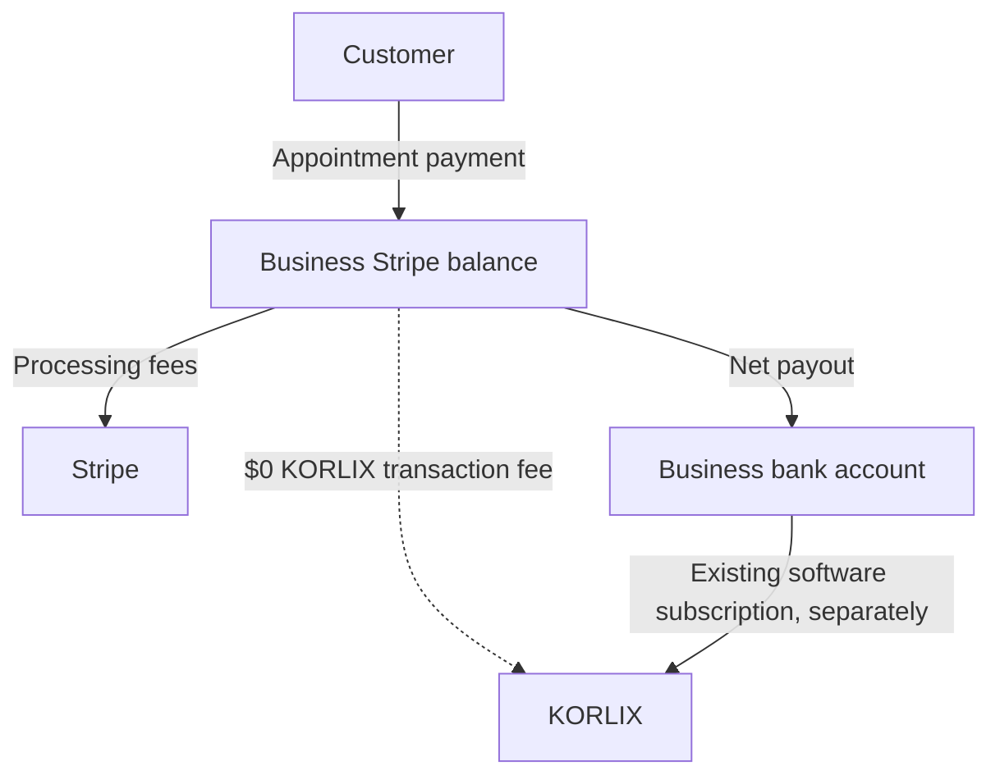

# KORLIX merchant payments — subscription-only Connect plan

Decision recorded 2026-10-05: businesses use KORLIX to collect payments from their own customers. The existing KORLIX subscription is the platform's monetization; KORLIX adds no transaction fee. Businesses still pay their own Stripe processing fees. Begin with 2MEETU appointments, then extend the connection to Funnel checkout and Bookkeeping invoices in later work.

## Account configuration

Use Accounts v2 (`/v2/core/accounts`) for new business accounts, with `dashboard: "full"`, `defaults.responsibilities.fees_collector: "stripe"` and `defaults.responsibilities.losses_collector: "stripe"`. Direct-charge businesses need `configuration.merchant` and requested `card_payments` capability; payout capability is requested automatically. Do not use a legacy account `type` for new account creation.

The current patch checks already connected accounts through v2. It does not create accounts. Stripe documents that v1-created accounts can take time to become available through v2. For the explicit `v1_account_instead_of_v2_account` or `account_not_yet_compatible_with_v2` HTTP 400 errors, OAuth callback and owner confirmation may verify identity through `/v1/accounts/{id}` instead. This identity-only path still requires the exact authorized account ID, full Dashboard access, account-paid Stripe fees, and Stripe-managed losses/requirements. It always records payment readiness as false, regardless of legacy payment flags. Checkout never uses this compatibility path and still requires fresh v2 capability verification.

## Charge pattern

Use direct charges on each connected business's Stripe account. The business sells the appointment and receives its proceeds, while KORLIX supplies the software. Existing Checkout Session requests use the server-selected `Stripe-Account` header, with no destination transfer or KORLIX application fee.

## Business onboarding

For new businesses, recommend embedded onboarding: KORLIX creates an owner-bound v2 merchant account, then Stripe collects the required identity and business information within its component. This keeps the user in KORLIX while Stripe handles verification forms and updated requirements. Enable payment acceptance only after independent capability verification, and continue checking before new checkouts.

The existing-account route remains OAuth with `read_write` scope because creating payments and refunds requires write access. The existing one-use state, browser binding, encrypted account grant, and explicit owner confirmation are preserved. No customer pastes a secret API key into KORLIX.

**Implementation boundary:** existing-account authorization is already present; v2 account creation, embedded onboarding, and a shared connection across other KORLIX tools remain planned work.

## Dashboard access

Businesses use their full Stripe Dashboard directly at [dashboard.stripe.com](https://dashboard.stripe.com). This fits independent businesses that manage their own processing, payment methods, disputes and bank details; KORLIX does not generate Express login links for them.

## Embedded components

For the future merchant settings screen, use `account_onboarding`, `notification_banner`, `account_management`, `payments` and `payouts`. The notification banner must show new requirements so businesses can keep their accounts enabled. Payments components can show direct charges owned by the connected account; confirm each enabled feature against [Stripe's supported components](https://docs.stripe.com/connect/supported-embedded-components) before implementation. None of these components is added in this backend patch.

## Webhook integration

Use signed webhooks with independent Stripe reads for reliable payment confirmation and ongoing account readiness, with detailed event implementation deferred to the Connect build phase and the [scheduling operations guide](korlix-scheduling.md).

## Readiness gating

Each new Checkout creation or retry must retrieve the expected account and confirm the sandbox/live mode, full dashboard, Stripe fee/loss responsibilities, and both capabilities:

- `configuration.merchant.capabilities.card_payments.status === "active"`
- `configuration.merchant.capabilities.stripe_balance.payouts.status === "active"`

The backend also requires complete provider settings and `KORLIX_SCHEDULING_STRIPE_ENABLED=true`. An absent, misspelled or false switch keeps new paid bookings and checkout off. The switch is excluded from the credential fingerprint so pausing does not invalidate saved grants. The database's existing `charges_enabled` column is only a projection of the v2 result.

## Fees and funds flow

KORLIX's transaction fee is **$0**. The internal recommendation value is `applicationFeeIncludes: "platform_fee_only"`: the platform does not add an estimate of Stripe fees or retain payment margin. `application_fee_amount` is an optional additional amount paid to a platform; for this model it is omitted, as are transfer routing fields. This is a design label, not a Checkout API parameter. Do not enable a Platform Pricing Tool rule that adds a platform fee, and verify the actual sandbox charge has no application fee before launch.

The connected business pays Stripe directly under Stripe-owned processing pricing. Its net proceeds are the customer payment less applicable Stripe fees and any adjustments. Rates vary by location and payment method; use [Stripe pricing](https://stripe.com/pricing) rather than hardcoded estimates.



## SaaS monetization

Keep the existing KORLIX subscription and entitlement policy. Do not create another subscription when a business connects Stripe. If billing connected accounts themselves is migrated to Accounts v2 later, use `customer_account` on the supported SetupIntent/subscription flows and map the existing subscription deliberately; do not create a duplicate v1 Customer solely for Connect. Current KORLIX web subscription checkout and Directory checkout remain paused independently.

## Negative balance liability

Recommend and verify `losses_collector: "stripe"` for these direct-charge business accounts. This assigns connected-account negative balance responsibility to Stripe under the selected Connect configuration; it does not eliminate the business's refund, dispute or repayment obligations under its Stripe agreement or guarantee that KORLIX has no contractual obligations.

## Risk management

Businesses use Stripe's risk tooling for their direct payments. KORLIX still enforces account ownership, payment limits, immutable checkout payloads, idempotency, signed callbacks and independent payment verification. A completed redirect never confirms a booking. Payments settling after the appointment hold expires may need a full refund; validate delayed payment methods in the sandbox before enabling them for live appointment sales.

## Implementation and rollout

1. **Prepared and locally tested:** explicit off-by-default payment switch; v2 merchant readiness; direct Checkout with dynamic eligible payment methods and no application fee; preserved payment confirmation and refund handling during a pause; public health status with no secrets.
2. **Stripe sandbox Connect verified:** although `EnableConnect` previously timed out twice, the user's Dashboard and a subsequent `GetAccounts` read confirm Connect is available in `Korlix INC sandbox`. Two test connected accounts already exist. One has full Stripe Dashboard access, account-paid processing fees and Stripe loss responsibility in the v1 controller projection; its v2 capability read and use by the KORLIX app remain unverified. The Dashboard's existing $200 test activity is not evidence that the new 2MEETU integration has passed acceptance.
3. **Configure an isolated sandbox environment:** sandbox OAuth client, API credentials and connected-account webhook signing secret must belong to the same sandbox. Preserve the scheduling encryption key for that environment; store secrets only in the backend secret store. Never switch the production backend to sandbox credentials for a test.
4. **Run provider acceptance:** authorize a test business; inspect its v2 settings/capabilities; complete and verify a test Checkout; test decline, duplicate delivery, delayed success/failure, refund and a paused checkout; confirm actual charge fee and account ownership. These tests have not yet been performed against Stripe.
5. **Build new-business onboarding:** add v2 account creation and the selected embedded components with owner-bound sessions and current requirements handling. Validate separately from existing-account OAuth.
6. **Live launch only after explicit go-live authorization and readiness:** review platform activation, permitted businesses/countries, business verification, tax handling, signed webhook delivery and operational refund support. Keep KORLIX web sales, Directory sales and 2MEETU payment switches false until their applicable launch gates are cleared.
7. **Later scope:** Funnel purchases and Bookkeeping invoice payments reuse the merchant connection after their own checkout, bookkeeping and refund workflows are built and tested. They are not implemented by this patch.

Pausing prevents new paid bookings and opening checkout through KORLIX. It does not revoke an already issued Stripe Checkout URL; use Stripe-side expiration if outstanding unpaid sessions must also be stopped. Payment confirmations and refunds intentionally remain available when credentials are configured.

## Why this fits KORLIX

- Independent businesses collect their own customer payments and retain full Stripe account access.
- Subscription revenue pays for KORLIX software; there is no additional platform transaction fee.
- 2MEETU already has a direct-charge, idempotent payment ledger that can be activated after provider testing.
- The framework can be deployed without enabling sales or changing existing subscription entitlements.

## Verification evidence

Focused local command:

```sh
node --test backend/test/scheduling.test.mjs backend/test/scheduling_connected.test.mjs backend/test/scheduling_voice.test.mjs backend/test/scheduling_stripe_provider.test.mjs
```

Result on 2026-10-05: **53 passed, 0 failed**. Provider responses in these tests are fixtures. Coverage includes full booking lifecycle and ownership checks, invalid account/mode/responsibilities, unavailable payment/payout capabilities, rejected fee/transfer injection, explicit activation, free bookings during pause, signed confirmation during pause, and completed queued refunds during pause. No real charges or refunds were made.

### Configuration checkpoint — 2026-10-05 UTC

The user supplied public sandbox OAuth client ID `ca_VNdRanZuoOmsl6nhhnunPkqTdRYu9hVo`. It is staged as `KORLIX_SCHEDULING_STRIPE_CLIENT_ID` on the disabled scheduling integration. Render deployment `dep-db1f8rs9v7es73f9nl3g` of application commit `70e23e2a158ff2383ff69b5abe9e146928747eae` is live. The scheduling, web subscription and Directory enable flags are all explicitly `false`.

The user saved the dedicated scheduling sandbox API key directly in Render; no secret API keys were requested through chat or copied from other production settings. A sandbox connected-account webhook was created as `we_1UN0aSLx6hd5l5Vo1WXs2c04`, targeting `https://chee-chai-chee-backend.onrender.com/api/scheduling/payments/webhook`. A follow-up Stripe read confirms it is enabled, `livemode=false`, and belongs to the same public OAuth application ID. It subscribes to `checkout.session.completed`, `checkout.session.expired`, `checkout.session.async_payment_succeeded`, `checkout.session.async_payment_failed`, and `charge.refunded`. Its API version is unset, so it inherits the account default; outbound application API calls remain pinned to `2026-09-30.endive`. The returned signing secret was transferred directly into `KORLIX_SCHEDULING_STRIPE_WEBHOOK_SECRET` without displaying it. The historical disabled Directory test endpoint was left untouched.

Render deployment `dep-db1fn56gekts73dk6q00` of commit `35550916783dcf049d7bdf48f7da3c479f914cc6` completed at 2026-10-05 01:21:54 UTC. Startup and public health now report the scheduling provider configured, `checkoutEnabled=false`, `livePayments=false`, and zero platform fee. All three checkout flags were explicitly preserved as `false`. These checks establish that configuration is loaded, not that the API key is valid or that Stripe has delivered a signed event successfully.

This is configuration staging in the previously unconfigured, dedicated scheduling integration on the existing backend. It is not an isolated acceptance environment and does not authorize production test bookings. Existing web subscription and Directory credentials were not changed. An isolated acceptance environment remains required for actual end-to-end test bookings.

The user's 2026-10-05 01:26 UTC screenshot verifies that OAuth is enabled in the sandbox and `https://chee-chai-chee-backend.onrender.com/api/scheduling/connect/stripe/callback` is saved as the default redirect. The user then initiated authorization from 2MEETU and chose Stripe's blank test account. Stripe created `acct_1UN0lvLxhlZExezM`; a Stripe read shows a full-dashboard account with Stripe fee/loss responsibility and payment/payout capabilities not yet enabled. The callback returned HTTP 503 at 01:32:57 UTC with a generic provider error, so the KORLIX connection did not complete.

Diagnostic support now logs only the Stripe operation phase, HTTP status, validated error code and request ID. It excludes raw URLs, credentials, authorization codes, provider messages and customer data. An optional `KORLIX_SCHEDULING_STRIPE_PROBE_ACCOUNT` performs one read-only account verification on startup, only when scheduling checkout is paused, settings are configured and the key has a test prefix. It does not persist a connection or create a payment. Stripe documents that newly created v1 accounts can take up to ten minutes to become available to v2 reads; the actual failure still needs to be identified, and authorization codes must never be replayed.

### OAuth compatibility correction

Diagnostic deployment `dep-db1fvtfavr4c73bnv1t0` (`55238686a4adb0ec39ed029849949b2540c83957`) reproduced HTTP 400 `v1_account_instead_of_v2_account` at 01:40:33 UTC, using the saved scheduling credentials and the exact account created in the failed OAuth attempt. This confirms the account lookup incompatibility. The correction allows verified OAuth account identity and explicit owner confirmation to complete while v2 eligibility is pending. It does not grant payment readiness using legacy `charges_enabled` or `payouts_enabled` values, and it does not fall back for authentication, authorization, missing-account or platform-access errors. Account mode continues to be verified against the OAuth token exchange and configured key context.

The initial failed authorization code must not be replayed; the user must initiate a fresh connection from 2MEETU after deployment. Completed user authorization, v2 payment readiness, signed delivery and payment acceptance remain open. Diagnostics regression passed 55 tests; the compatibility regression additionally covers rejected account/responsibility mismatches, no payment creation without v2 readiness, and a full fixture OAuth callback plus owner confirmation.

## Open launch items

Actual OAuth authorization, Accounts v2 readiness and 2MEETU payment acceptance remain unverified. Confirm the initial supported merchant countries and service categories before international onboarding; a US company account alone does not establish support in every country. Appointment tax calculation is not included in this release. Tax treatment for KORLIX's own subscriptions remains a separate launch gate, including the user's pending Ohio registration work.

## Stripe references

- [SaaS connected accounts](https://docs.stripe.com/connect/saas/tasks/create)
- [SaaS onboarding](https://docs.stripe.com/connect/saas/tasks/onboard)
- [Accept a direct payment](https://docs.stripe.com/connect/saas/tasks/accept-payment)
- [Retrieve an Accounts v2 account](https://docs.stripe.com/api/v2/core/accounts/retrieve)
- [Migrate an existing integration to Accounts v2](https://docs.stripe.com/connect/accounts-v2/migrate-integration)
