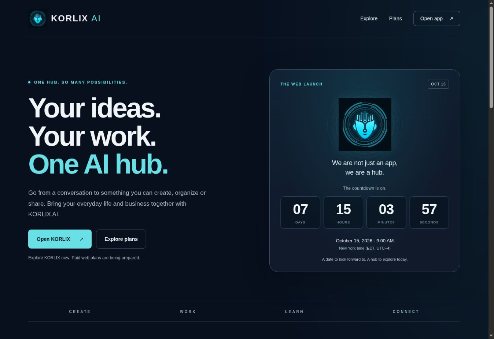
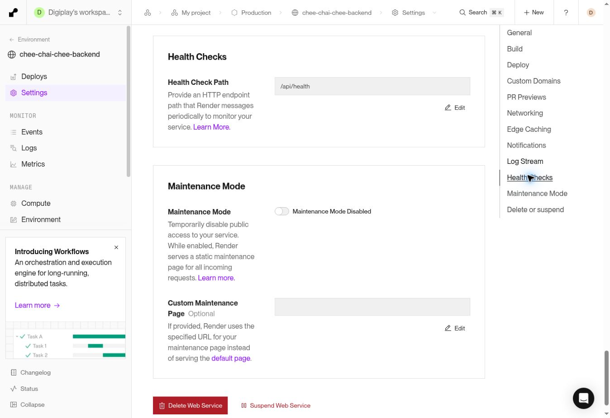

# Web launch preparation: publication record

Verified October 7, 2026. **Countdown and preparation changes are live; overall launch readiness remains conditional on the gates in `WEB_LAUNCH_READINESS_20261007.md`.**

## Released code

| Component | Commit | Deployment | Live at (UTC) |
| --- | --- | --- | --- |
| Website and Flutter web app | `b61e7664334e0b7800e1a66009b17ccf0a5036c5` | `dep-db3bu560tbcc73d432r0` | 2026-10-07 21:55:08 |
| Backend | `28f7ec37262ff985b9bf0addb834b3d537846a6e` | `dep-db3bundg1s2s739qgcig` | 2026-10-07 21:54:07 |

The evidence-only follow-up commit does not change either running application. Both services retain manual deployments. The backend HTTP health check is `/api/health`; maintenance mode remains off.

## Verified behavior

- All 14 public landing, countdown asset, pricing and policy responses returned HTTP 200 and matched the released bytes. Checksums and exact URLs are in `evidence/web-launch-20261007/verification.json`.
- Browser inspection showed the correct October 15, 2026, 9:00 AM Eastern deadline and decreasing seconds. The desktop layout had no horizontal overflow. The homepage screenshot shows the actual live release.
- `/app/` returned HTTP 200 and reached its rendered sign-in form, including the 16+ notice and policy links. No credentials were entered and no account was created. The signed-in home ticker was covered by source/widget tests, not a live authenticated session.
- Render's production build recorded `+154: All tests passed!`; the same selected gate passed locally. The JavaScript countdown passed 7 tests. Focused backend persistence, route-security, aggregate-readiness and receipt-recovery suites passed 30 tests, including 12 recovery tests. The renamed production-aligned migration fixture also passed its 7 persistence tests.
- `/api/health` returned HTTP 200 with the existing database/auth configuration present. Reporting health returned version `v4`. Anonymous access to `/api/report-output/recent` returned HTTP 403.
- Web subscriptions, Directory paid checkout and scheduling payments all still report `checkoutEnabled: false`. No payment flags were enabled, transactions created, or registration/tax status changed.
- Migration `20261007214516_durable_ai_report_queue` is applied. RLS is enabled, browser roles have no privileges, and the service role has CRUD. The current Supabase security advisor returned no WARNING or ERROR entries (one INFO entry); this is not a complete security certification.
- The recovery drill passed encryption, byte-hash, corruption and wrong-owner checks using generated synthetic data. It made no network request and explicitly reported `productionBackupActivated: false`.

## Still open

Owner registration/tax readiness and any later release of the paid-sales pause; independent backup destination/key custody/schedule/alerts and an actual isolated restoration; confirmed support/moderation coverage, legacy-report triage and full deletion rehearsal; native PostgreSQL storage/RPC validation on a supported isolated runner; final real-device acceptance checks.

No user data, customer receipts, private report contents, account deletion, report-resolution action or outbound support email was used in this verification. The backend checkout's unrelated video change and temporary Supabase files were excluded from publication.

## Visual evidence

