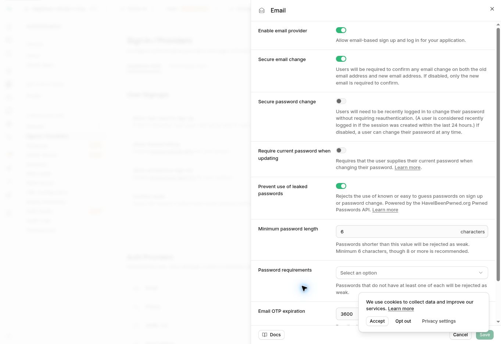
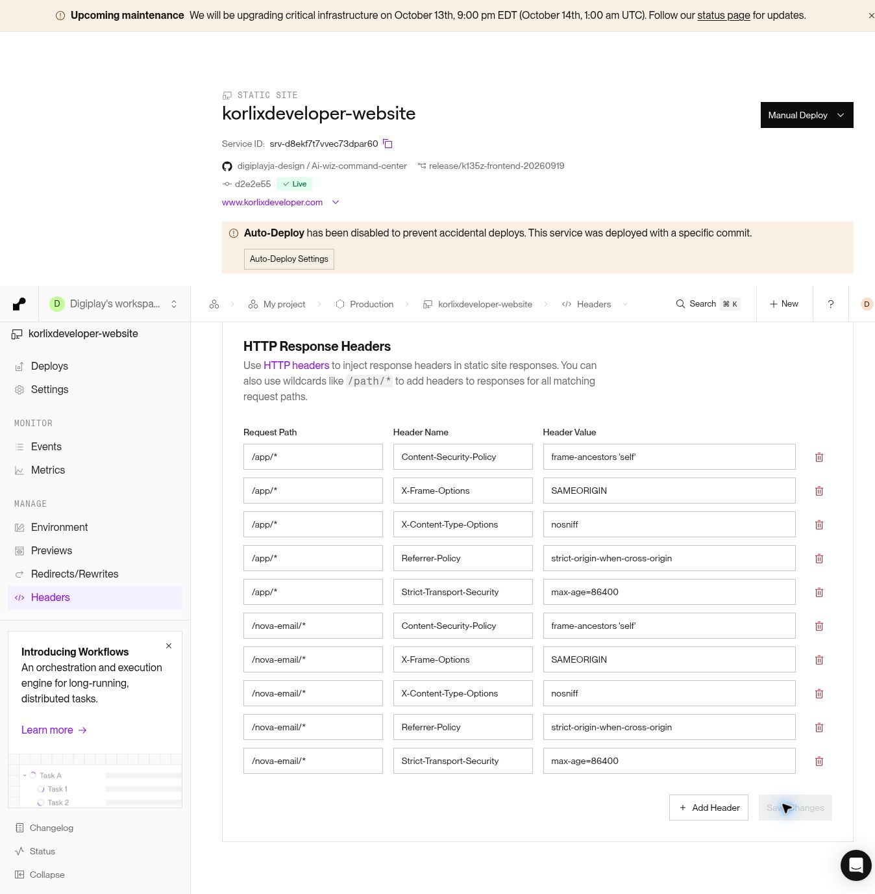
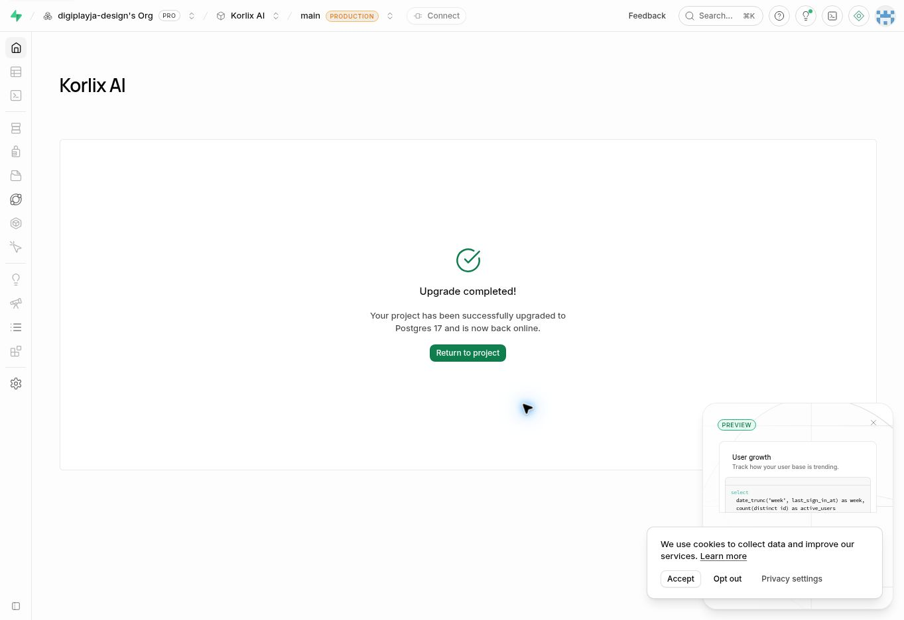
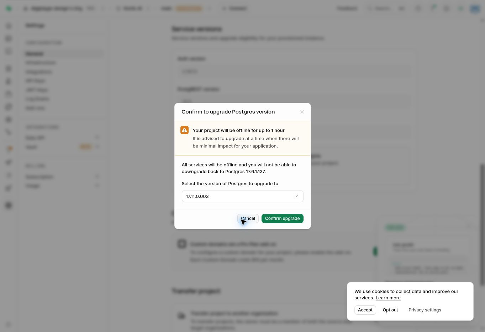

# KORLIX provider security settings — 7 October 2026

Completed using the authorized Supabase and Render dashboards. Application release code remains backend `4d2fb6d4fa473f68bbd83a52f82799af230f0ed8` and frontend `d2e2e5539aae79c5b6fea5a603f601c057552333`; this record changes documentation and evidence only.

## Completed and verified

- **Supabase leaked-password protection:** enabled and saved for Korlix AI (`uxtjzjbwtppjvnsoiijv`). Reopening the Email settings confirms it remains enabled. The Security Advisor now returns only 236 informational RLS-without-policy findings for server-only tables; no leaked-password warning remains. Organization is already Pro; no plan or billing changes made.
- **Render response headers:** all ten scoped rules saved successfully on static service `srv-d8ekf7t7vvec73dpar60`. Five rules each apply to `/app/*` and `/nova-email/*`: `Content-Security-Policy: frame-ancestors 'self'`, `X-Frame-Options: SAMEORIGIN`, `X-Content-Type-Options: nosniff`, `Referrer-Policy: strict-origin-when-cross-origin`, and `Strict-Transport-Security: max-age=86400`.
- **Live delivery:** HTTP 200 and the intended protections verified for `/app/`, `/app/main.dart.js` and `/nova-email/` on both `www.korlixdeveloper.com` and the Render hostname. Render's hostname retains its stronger platform HSTS value (`max-age=315360000; includeSubdomains; preload`); the custom domain serves the configured one-day value. Exact results are in `DASHBOARD_HEADER_VERIFICATION_2026-10-07.json`.
- **Public application check:** the Flutter app renders the normal sign-in form and 16+ notice after these settings. No customer login, purchase, email or location capture was performed.

## Database upgrade completed

Current database: **17.11.0.003**, **ACTIVE_HEALTHY**, upgraded from 17.6.1.127. A live SQL query independently reports PostgreSQL **17.11**. The stable target was explicitly selected; the preview build was not used.

After reviewing the provider's outage/no-downgrade warning, the user authorized **“Start now.”** The scheduled backup and project health were rechecked before confirmation. Supabase records the start at **13:34:26 UTC / 09:34:26 America/New_York** on October 7. The project was observed ACTIVE_HEALTHY at **13:40:28 UTC / 09:40:28 America/New_York**, approximately six minutes later. This is observed upgrade duration, not a measurement of customer-visible downtime. The dashboard explicitly reports **Upgrade completed** and that the project is back online. No paid plan change or manual compute/storage resize was requested.

Post-upgrade verification:

- All **253 public tables** retain RLS; **24 public policies** remain. Zero browser MAINTAIN grants and zero browser-callable public SECURITY DEFINER functions.
- All **16 storage buckets** remain private.
- Report/deletion intake and the deletion RPC remain inaccessible to browser roles; service-role access remains intact. Restrictive intake policies still deny browser rows.
- Security Advisor returned no warnings or errors, only informational RLS-without-policy guidance. Leaked-password protection's warning did not return.
- The backend health endpoint returns HTTP 200. Its Supabase diagnostics endpoint successfully reaches the project's Auth service (HTTP 200). The application HTML returns HTTP 200 with the security headers still present.
- The public app renders its sign-in form after upgrade. These checks do not represent an authenticated customer transaction or a complete integration test.

Exact metadata, timestamps, privilege results and HTTP checks are recorded in `DATABASE_UPGRADE_VERIFICATION_2026-10-07.json`.

Readiness checks:

| Check | Observed result |
|---|---|
| Latest listed physical backup | 2026-10-07 06:14:56 UTC; 02:14:56 America/New_York; Restore control available |
| Read replicas | Dashboard explicitly says No read replicas |
| Logical / physical replication slots | 0 / 0 |
| Active WAL sender connections | 0 |
| Unsupported extensions | None found in documented unsupported list |
| MD5-password login roles | 0 of 10; no password hashes disclosed |
| Unsupported reg* data columns | None; provider regclass/regrole types are supported |
| pg_cron / cron job history | Not installed / absent |
| Database logical size | Approximately 40.8 MiB; this is not a downtime guarantee |
| Release-specific compatibility | Earlier preflight found no affected ltree, float GiST, custom-operator or legacy pgcrypto uses |

The backup check verifies an available provider backup, not an independent restore drill or a zero-loss recovery point. Supabase's dashboard explicitly warns that database backups exclude Storage object bytes. Independent restore and receipt recovery drills remain separate release work.

## Screenshot evidence

Saved settings:

Completed upgrade:

Historical warning reviewed before the user approved the outage:

## Documentation

- [Supabase upgrade process](https://supabase.com/docs/guides/platform/upgrading)
- [17.11 security release and compatibility notes](https://supabase.com/changelog/postgres-15-19-17-11-breaking-changes)
- [Database backups](https://supabase.com/docs/guides/platform/backups)
- [Password security](https://supabase.com/docs/guides/auth/password-security)
- [Render static-site headers](https://render.com/docs/static-site-headers)
